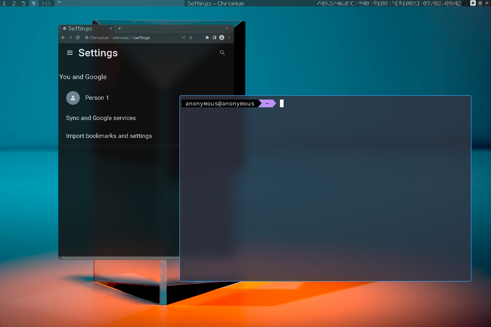

# My Dwm Statusbar #
This is the repo of my dwm status bar script.



___Do not make any issue if you haven't read the troubo shooting below(In particular, the section on hardware temperature capture).___
# Usage #
Clone the repo with command below in your terminal
```
$ git clone https://github.com/Lew1s777/dwm-statusbar.git
```
Then start your [dwm](https://dwm.suckless.org/) and run
```
$ bash ./dwm-status.sh
```
To auto start at the dwm launch,patch your dwm an autostart patch and add the status bar script to your autostart script.

# Things you HAVE TO KNOW-Troublem shooting #
#### no cpu/gpu temperature ####
The line 39 to line 51 are the temperature function
```
print_cpu_temp(){
        cpu=/sys/class/hwmon/hwmon3/temp1_input
        cpu="$(($(< "$cpu") * 100 / 10000))"
        cpu="${cpu/${cpu: -1}}.${cpu: -1}"
        echo "$cpu"
}

print_gpu_temp(){
        gpu=/sys/class/hwmon/hwmon5/temp1_input
        gpu="$(($(< "$gpu") * 100 / 10000))"
        gpu="${gpu/${gpu: -1}}.${gpu: -1}°${gpu_temp:-C}"
        echo "$gpu"
}
```
It gets my cpu temperature from sensor 「/sys/class/hwmon/hwmon3/temp1_input」and gpu's from 「/sys/class/hwmon/hwmon5/temp1_input」.However,the path depend on the specific machine,which means that you need to change it to your machine's path.

Your sensors output should be under the
```/sys/class/hwmon/hwmon*/```


Under the folder,there will have many file named temp```[number]_input```,that is your temperature sensor's output.

To identify which hardware it refer to,check the file that named ```[the same number]_label```

Once you found your own path of sensors' output,use it to replace the path in the original script.

#### No status bar? ####

make sure your windows manager is [dwm](http://dwm.suckless.org/)(___Under xorg___),not [dwl](https://github.com/djpohly/dwl) or whatever it is.

